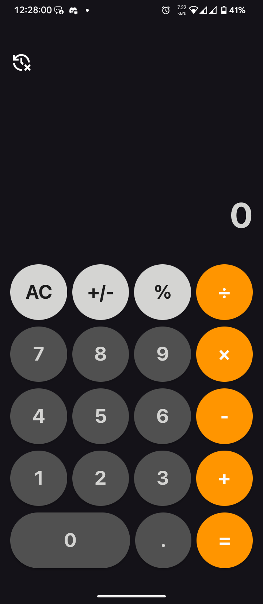
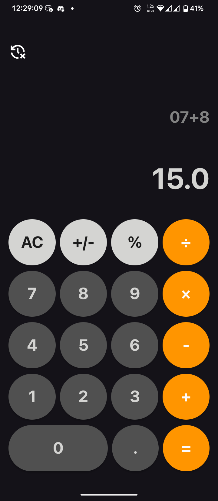

# iOScalc

An iOS-style Calculator app built with Kotlin and XML for Android.  

This project is fully open-source.

---

##  Features

- iOS-inspired design  

- Basic arithmetic: addition, subtraction, multiplication, division  

- Built using modern Android practices (Kotlin + XML)  

- Lightweight and simple  

---

##  Screenshots

<p align="center">

  

  

</p>

---

##  Installation

Download the latest APK from the [Releases](https://github.com/rashbip/iOScalc/releases) page and install it on your Android device.

---
##  Build Instructions

1. Clone the repository:
   ```bash
   git clone https://github.com/rashbip/iOScalc.git
   cd iOScalc
    ```

2. Open the project in **Android Studio**
3. Build and run on an emulator or physical device

---

##  Libraries Used

* [keval()](https://github.com/kevalpatel2106/keval) — Expression evaluation library

---

##  Contributing

Contributions are welcome!

* Open an issue if you find bugs or want to suggest features.
* Submit a pull request to improve the app.

---
